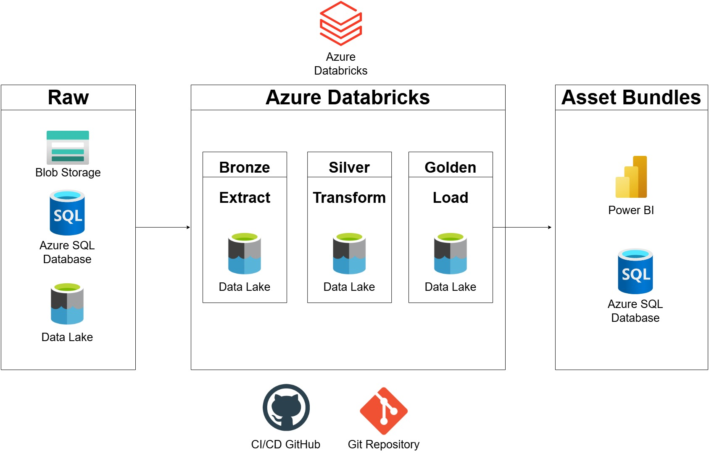
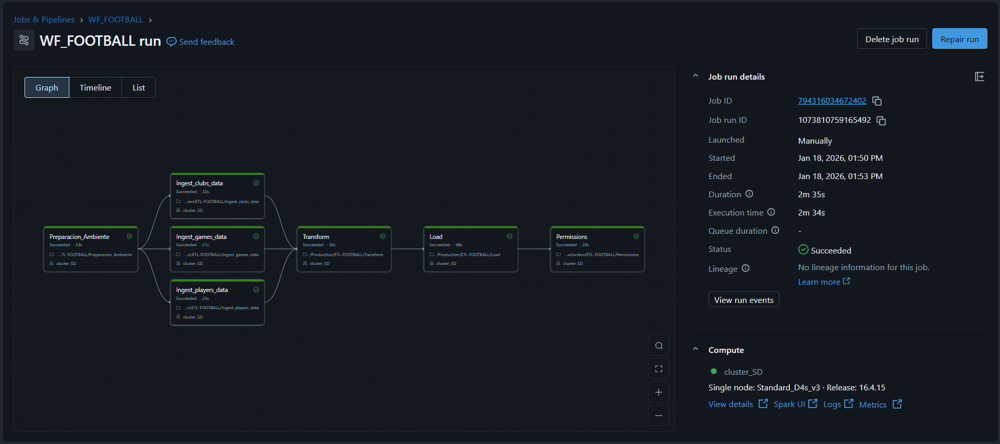

<div align="center">

# ⚽ ETL Football – Databricks, Azure & Power BI
### Arquitectura Medallion en Azure Databricks

[](https://databricks.com/)
[](https://azure.microsoft.com/)
[](https://spark.apache.org/)
[](https://delta.io/)
[](https://www.microsoft.com/es-es/power-platform/products/power-bi)
[](https://github.com/features/actions)

*Pipeline automatizado de datos para análisis de clubes de fútbol con arquitectura de tres capas y despliegue continuo*

</div>

---

## 📌 Descripción del Proyecto

Este proyecto implementa un pipeline ETL completo utilizando la arquitectura Medallion (Bronze, Silver, Gold) en Azure Databricks con PySpark. El objetivo es procesar datos desde múltiples fuentes (Azure Data Lake, Blob Storage, SQL Database, CosmosDB) y disponibilizarlos para análisis en Power BI.

### ✨ Características Principales

- 🔄 **ETL Automatizado** - Pipeline completo con despliegue automático via GitHub Actions
- 🏗️ **Arquitectura Medallion** - Separación clara de capas Bronze → Silver → Gold
- 📊 **Modelo Dimensional** - Star Schema optimizado para análisis de negocio
- 🚀 **CI/CD Integrado** - Deploy automático en cada push a master
- 📈 **Power BI** - Visualización
- ⚡ **Delta Lake** - ACID transactions y time travel capabilities
- 🔔 **Monitoreo** - Notificaciones automáticas y logs detallados

---

## 🏛️ Arquitectura

### Flujo de Datos

```
📄 Azure Data Lake + Blob Storage + Azure SQL DataBase (Raw Data)
    ↓
🥉 Bronze Layer (Ingesta de datos)
    ↓
🥈 Silver Layer (Limpieza + Transformacion + Modelo Dimensional)
    ↓
🥇 Gold Layer (Carga + Agregaciones de Negocio)
    ↓
📊 Power BI (Visualización)
```




### 📦 Capas del Pipeline

<table>
<tr>
<td width="33%" valign="top">

#### 🥉 Bronze Layer
**Propósito**: Zona de aterrizaje

**Tablas**: 
- `clubs` 
- `games` 
- `players`

**Características**:
- ✅ Datos sin procesar, como vienen del origen
- ✅ Timestamp de ingesta
- ✅ Preservación histórica
- ✅ Sin validaciones

</td>
<td width="33%" valign="top">

#### 🥈 Silver Layer
**Propósito**: Modelo dimensional

**Tablas**:
- `club_performance`
- `player_market`
- `match_analysis`

**Características**:
- ✅ Star Schema
- ✅ Datos normalizados
- ✅ Validaciones completas

</td>
<td width="33%" valign="top">

#### 🥇 Gold Layer
**Propósito**: Analytics-ready

**Tablas**:
- dbo.tbl_club_performance      : Rendimiento de Clubes por Temporada
- dbo.tbl_player_market         : Valor de Mercado y Perfil de Jugadores
- dbo.tbl_match_analysis        : Análisis de Partidos y Asistencia

**Características**:
- ✅ Pre-agregados
- ✅ Optimizado para BI
- ✅ Performance máximo
- ✅ Actualizaciones automáticas

</td>
</tr>
</table>

---

## 📁 Estructura del Proyecto

```
etl-football/
│
├── 📂 .github/
│   └── 📂 workflows/
│       └── 📄 deploy_dev_to_prod.yml    # Pipeline CI/CD deploy a certification workspace databricks
├── 📂 process/
│   ├── 🐍 Ingest players data.py    # Bronze layer
│   ├── 🐍 Ingest clubs data.py      # Bronze Layer
│   ├── 🐍 Ingest games data.py      # Bronze Layer
│   ├── 🐍 Transform.py              # Silver Layer
│   └── 🐍 Load.py                   # Gold Layer
│   └── 🐍 Preparacion_Ambiente.py   # Create Schema, Tables, External location
├── 📂 security/
|   ├── 🐍 Permissions.py            # Sql Grant
├── 📂 reversion/
|   ├── 🐍 revoke.py               # Revoke permissions
├── 📂 dashboards/                 # Power BI Dashboards 
└── 📄 README.md
```

---

## 🛠️ Tecnologías

<div align="center">

| Tecnología | Propósito |
|:----------:|:----------|
|  | Data Lake para almacenamiento persistente |
|  | Motor de procesamiento distribuido Spark |
|  | Storage layer con ACID transactions |
|  | Framework de transformación de datos |
|  | Automatización CI/CD |
|  |  Visualización |

</div>

---

## ⚙️ Prerequisitos

- ☁️ Azure Databricks
- 💻 Workspace de Databricks configurado
- 🖥️ Cluster activo
- 📦 Azure Data Lake Storage Gen2
- 📦 Azure Blob Storage
- 📦 Azure SQL Database
- 📦 Azure Key Vault (para secretos)
- 📊 Power BI Desktop (opcional para visualización)
- 🐙 Cuenta de GitHub con permisos de administrador

---

## 🚀 Instalación y Configuración

### 1️⃣ Clonar el Repositorio

```bash
git clone https://github.com/HenryRodriguezM/football.git
cd football
```

### 2️⃣ Configurar Databricks Token

1. Ir a Databricks Workspace
2. **User Settings** → **Developer** → **Access Tokens**
3. Click en **Generate New Token**
4. Configurar:
   - **Comment**: `GitHub CI/CD`
   - **Lifetime**: `90 days`
5. ⚠️ Copiar y guardar el token

### 3️⃣ Configurar GitHub Secrets

Ir al menu del repositorio: **Settings** → **Secrets and variables** → **Actions**

| Secret Name | Valor Ejemplo |
|------------|---------------|
| `DATABRICKS_HOST` | `https://adb-xxxxx.azuredatabricks.net` |
| `DATABRICKS_TOKEN` | `dapi_xxxxxxxxxxxxxxxx` |

### 4️⃣ Verificar Storage Configuration

```python
storage_path = "abfss://raw@adlsmartdata2026.dfs.core.windows.net/"
```

<div align="center">

✅ **¡Configuración completa!**

</div>

---

## 💻 Uso

### 🔄 Despliegue Automático (Recomendado)

```bash
git add .
git commit -m "✨ feat: mejoras en pipeline"
git push origin master
```

**GitHub Actions ejecutará**:
- 📤 Deploy de notebooks a `/Production/ETL-FOOTBALL`
- 🔧 Creación del workflow `WF_FOOTBALL`
- ▶️ Ejecución completa:  Bronze → Silver → Gold
- 📧 Notificaciones de resultados

### 🖱️ Despliegue Manual desde GitHub

1. Ir al tab **Actions** en GitHub
2. Seleccionar **Deploy ETL Apple Sales And Warranty**
3. Click en **Run workflow**
4. Seleccionar rama `main`
5. Click en **Run workflow**

### 🔧 Ejecución Local en Databricks

Navegar a `/Production/ETL-Football` y ejecutar en orden:

```
- Preparacion_Ambiente.py         → Crear esquema
- Ingest clubs data.py            → Bronze Layer
- Ingest players data.py          → Bronze Layer
- Ingest games data.py            → Bronze Layer
- Transform.py                    → Silver Layer
- Load.py                         → Gold Layer
```

---


## 🔄 CI/CD

### Pipeline de GitHub Actions

```yaml
Workflow: Deploy ETL Apple Sales And Warranty
├── Deploy notebooks → /Production/ETL-FOOTBALL
├── Eliminar workflow antiguo (si existe)
├── Buscar cluster configurado
├── Crear nuevo workflow con 4 tareas
├── Ejecutar pipeline automáticamente
└── Monitorear y notificar resultados
```

### 🔄  Workflow Databricks

```


⏰ Schedule: Diario 8:00 AM (Lima)
⏱️ Timeout total: 4 horas
 🔒 Max concurrent runs: 1
⏰ Notificaciones: 
      success: rodriguez.montero.henry@outlook.com
      failed:  rodriguez.montero.henry@outlook.com
```

---

## 📈 Dashboards
https://github.com/HenryRodriguezM/football/tree/main/dashboard

## 🔍 Monitoreo

### En Databricks

**Workflows**:
- Ir a **Jobs & Pipelines** en el menú izquierdo
- Buscar `ETL_Football`
- Ver historial de ejecuciones

**Logs por Tarea**:
- Click en una ejecución específica
- Click en cada tarea para ver logs detallados
- Revisar stdout/stderr en caso de errores

### En GitHub Actions

- Tab **Actions** del repositorio
- Ver historial de workflows
- Click en ejecución específica para detalles
- Revisar logs de cada step

---

## 👤 Autor

<div align="center">

### Henry Herik Rodriguez Montero

[](https://www.linkedin.com/in/henry-rodriguez-7b273169/)
[](https://github.com/HenryRodriguezM)
[](mailto:henryrm33@gmail.com
)

**Data Engineering** | **Azure Databricks** | **Delta Lake** | **CI/CD**

</div>

---

## 📄 Licencia

Este proyecto está bajo la Licencia MIT - ver el archivo [LICENSE](LICENSE) para más detalles.

---

<div align="center">

**Proyecto**: Data Engineering - Arquitectura Medallion  
**Tecnología**: Azure Databricks + Delta Lake + CI/CD  
**Última actualización**: 2026


</div>